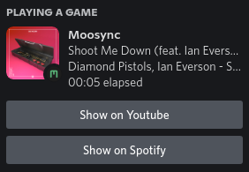
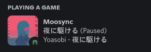

# Discord Rich Presense for Moosync

This is an extension for [Moosync](https://moosync.app) which sets discord rich presence based on currently playing song.

## Information
This extension makes use of [imgbb](https://imgbb.com/) to show artwork for your music. 

By default the images are uploaded to a public profile on imgbb. If you don't want this, you can generate your own API Key from [here](https://api.imgbb.com/).

## Known bugs

### Connection issue with Flatpak version of Moosync 

Due to how flatpak apps are sandboxed and have limited permissions, access to discord's ipc needs to be granted explicitly.

If you're using normal version of discord  
```sudo flatpak override app.moosync.moosync --filesystem=xdg-run/discord-ipc-0```  

If you're using flatpak version of discord  
```sudo flatpak override app.moosync.moosync --filesystem=xdg-run/app/com.discordapp.Discord:create```  
[(You may also refer to this guide for flatpak version of discord)](https://github.com/flathub/com.discordapp.Discord/wiki/Rich-Precense-(discord-rpc))

## Screenshots




